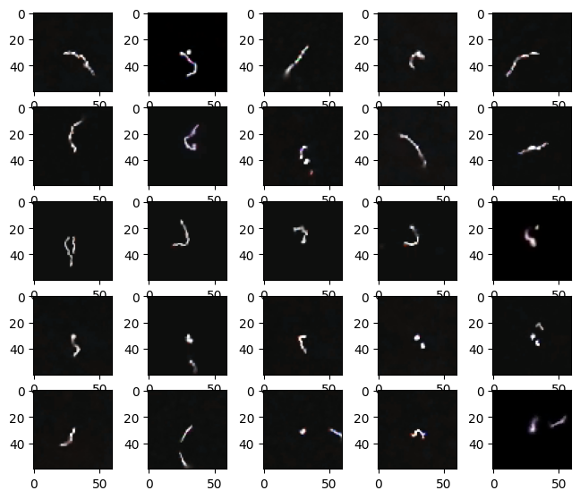

### Source codes for paper:

# Searching of potentially anomalous signals in cosmic-ray particle tracks images using rough k-means clustering combined with eigendecomposition-derived embedding

Abstract: Our work presents the application of the rough sets method in the field of astrophysics for the analysis of observational data recorded by the Cosmic Ray Extremely Distributed Observatory (CREDO) project infrastructure. CREDO research has produced huge datasets that are not well yet studied in terms of the information they contain, including specific anomalous observations, which are of particular interest to physicists.  From the pool of data available for analysis registered under CREDO infrastructure, containing approximately $10^7$ of events, a set of $10^4$ of samples was selected. We have applied eigendecomposition-derived embedding limiting data to 62 dimensions (95\% of variance). We have adapted rough k-means algorithm for the purpose of anomalies detection task. We have validated our approach on various configurations of adaptable parameters of the proposed algorithm. The potential anomalies retrieved with the proposed algorithm have morphological features consistent with what a human expert would expect from anomalous signals in this case. The source codes and data of our experiments are available for download to make research reproducible.

Keywords: Cosmic-ray particle, Anomalies detection, Rough sets, Rough k-means, CMOS detectors, eigendecomposition.

## Requirements

- Python 3.X
- numpy >= 1.22
- opencv-python >= 4.5

## Example resutls

Visualization of the results of the proposed algorithm for rough k-means with paramters $(k=4,t=1.25,w_{lower}=0.9,w_{upper}=0.1)$.

## Full text

TBA

## Cite as

TBA

## Source code references

I have used parts of source codes from:
- [Rough k-means clustering](https://github.com/geofizx/rough-clustering)
